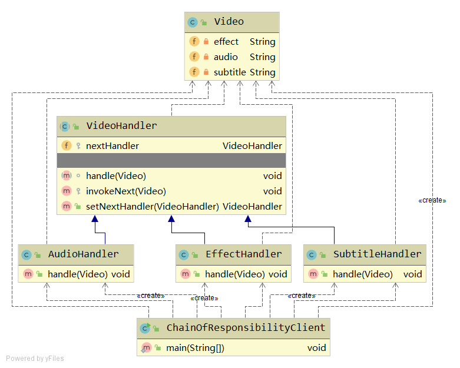

# 责任链

责任链模式。用于链式处理，分离职责。

每一个处理对象决定它能处理哪些部分，也知道如何将它不能处理的部分传递给该链中的下一个处理对象。

## Java code implementation


### 参与者和协作者分析
- Video：视频类，表示被处理的对象。
- VideoHandler：视频处理器抽象类，表示一种视频处理器类型。
  - EffectHandler 特效处理器
  - SubtitleHandler 字幕处理器
  - AudioHandler 音频处理器
- ChainOfResponsibilityClient：测试客户端

### 处理流程
- 创建视频
- 特效处理 -> 音频处理 -> 字幕处理

### 代码
VideoHandler
```java
public abstract class VideoHandler {

    // 抽象方法，将具体处理逻辑的变化封装于这个方法中
    abstract void handle(Video video);

    protected VideoHandler nextHandler;
    
    // 调用下一个处理器的处理逻辑
    protected void invokeNext(Video video) {
        if (nextHandler != null) {
            nextHandler.handle(video);
        }
    }
    
    // 将入参设置为下一个处理器，并返回入参处理器，方便链式调用
    public VideoHandler setNextHandler(VideoHandler nextHandler) {
        this.nextHandler = nextHandler;
        return nextHandler;
    }
}
```

AudioHandler
```java
public class AudioHandler extends VideoHandler {

    @Override
    public void handle(Video video) {
        System.out.println("Add audio to video...");

        this.invokeNext(video);
    }
}
```

ChainOfResponsibilityClient
```java
public class ChainOfResponsibilityClient {
    public static void main(String[] args) {
        Video           video           = new Video();
        EffectHandler   effectHandler   = new EffectHandler();
        AudioHandler    audioHandler    = new AudioHandler();
        SubtitleHandler subtitleHandler = new SubtitleHandler();

        effectHandler.setNextHandler(audioHandler)
                     .setNextHandler(subtitleHandler)
                     .setNextHandler(null);

        // video 传入第一个处理者即可
        effectHandler.handle(video);

        /*
        Add effect to video...
        Add audio to video...
        Add subtitle to video...
         */
    }
}
```
