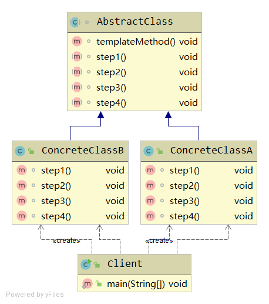

# Template Method
> 定义一个操作中算法的骨架，将一些步骤延迟到子类中。不改变算法的结构而重定义它的步骤。--《设计模式》

通俗来说，就是定义一系列具有顺序的执行步骤，某个特定步骤的实现可以延迟到子类中。
```java
doSomething(){
  step1()
  step2()
  step3() //例如将这个步骤的实现延迟到子类中
  step4()
}
```
实现步骤：
- 创建一个抽象类AbstractClass，使用抽象方法实现一个过程templateMethod（一系列执行步骤）。
- 这些抽象方法必须在子类中实现，由于这些步骤的实现是变化的，因此一般结合Strategy模式。

## Java code implementation
