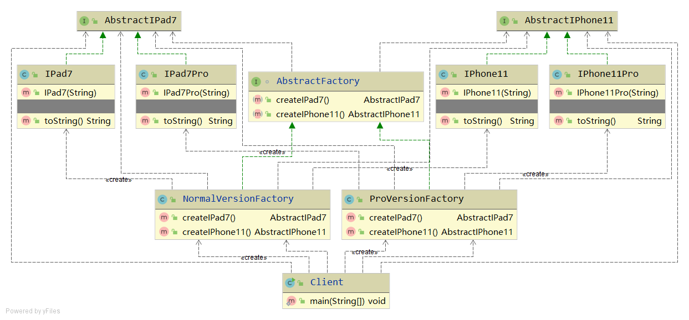

# Abstract Factory
抽象工厂。协调一组对象的创建。

## 假设有这么一个生产需求

|产品线|普通版|Pro|
|---|---|---|
|iPad7| iPad普通版| iPad7 Pro |
|iPhone11| iPhone11普通版 |iPhone11Pro|

那么可以这样考虑，有两个工厂，一个专门生产高配Pro，一个专门生产普通版
- 高配工厂：生产iPad7Pro，iPhone11Pro
- 普通版工厂：生产iPad7，iPhone11

无论是高配还是普通版的工厂，它们都属于工厂，所以可以抽象出一个工厂，称为抽象工厂。这个抽象工厂的功能有：
- 生产iPad7类型的产品，不关心高低配。
- 生产iPhone11类型的产品，不关心高低配。

整理一下参与者和协作者
- AbstractFactory
  - NormalVersionFactory
  - ProVersionFactory
- AbstractIPad7
  - IPad7
  - IPad7Pro
- AbstractIPhone11
  - IPhone11
  - IPhone11Pro
  
重点：抽象工厂生产抽象的产品 => AbstractFactory 生产 AbstractIPad7 或者 AbstractIPhone11

## UML class diagram
https://zh.wikipedia.org/wiki/File:Abstract_factory_UML.svg#file

## Java code implementation

