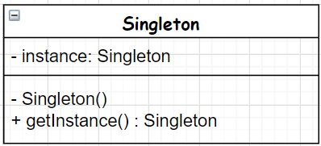
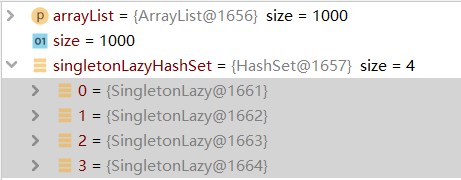

# Singleton
单例模式。
- 目的：希望对象只有一个实例。
- 参与者与协作者：Client对象只能通过getInstance方法获取Singleton实例。
- 实现步骤
  - 使用类私有静态成员变量，保存所需对象。
  - 使用公共静态方法，在成员为null时实例化这个类，返回实例。
  - 将构造函数设置为保护或者私有，避免直接实例化这个类。

## UML class diagram


## Java code implementation
单例模式有很多变体
- 懒汉，线程不安全
- 懒汉，线程安全
- 双重检查锁
- 饿汉式
- 静态内部类
- 枚举类

### 懒汉，线程不安全
```java
public class SingletonLazyForSingleThread {
    private static SingletonLazyForSingleThread instance;

    private SingletonLazyForSingleThread() {
    }

    public static SingletonLazyForSingleThread getInstance() {
        if (instance == null) {
            instance = new SingletonLazyForSingleThread();
        }
        return instance;
    }
}
```
- 特点：类加载时不初始化instance；在Client第一次调用getInstance()方法时，才进行判断并初始化
- 限制：不适用于多线程环境。下面是1000个线程同时调用SingletonLazyForSingleThread.getInstance()的结果：产生了四个不同的实例。


### 懒汉，线程安全
```java
public class SingletonLazyForMultiThread {
    private static SingletonLazyForMultiThread instance;

    private SingletonLazyForMultiThread() {
    }

    public synchronized static SingletonLazyForMultiThread getInstance() {
        if (instance == null) {
            instance = new SingletonLazyForMultiThread();
        }
        return instance;
    }
}
```
- 特点：方法级别的线程同步。保证多线程环境下实例的唯一性。
- 限制：不高效。因为方法同步只需要在第一次创建单例时才被需要，后续都不需要（此时实例都不为null）。

### 双重检查锁
double-check lock。
```java
public class SingletonDoubleCheckLocking {
    private static SingletonDoubleCheckLocking instance;

    private SingletonDoubleCheckLocking() {
    }

    public static SingletonDoubleCheckLocking getInstance() {
        // 先进行常规null判断
        if (instance == null) {
            //同步所有线程，这时才能看到所有线程的最新结果
            synchronized (SingletonDoubleCheckLocking.class) {
                // 如果所有线程都还没有创建instance，那就创建
                if (instance == null) {
                    instance = new SingletonDoubleCheckLocking();
                }
            }
        }
        return instance;
    }
}
```
- 特点：适用于多线程。
- 存在问题：`instance = new SingletonDoubleCheckLocking();`不是原子操作。它是线程可分的。
  - 1.给 instance 分配内存
  - 2.调用 SingletonDoubleCheckLocking构造函数初始化成员变量
  - 3.将 instance 对象指向第2步分配的内存空间（此时 instance 才是非 null）
  - JVM 即时编译器存在指令重排。上面的第二步和第三步的顺序不能保证，执行顺序可能是 1-2-3 也可能是 1-3-2。如果是1-3-2，
  则在 3 执行完毕、2 未执行之前，被线程二抢占了，这时 instance 非 null （却没有正常初始化），线程二会直接返回 instance，然后使用，肯定会报错。
  
为了解决JVM即时编译器存在指令重排的问题，可以使用volatile关键字。
```java
private volatile static SingletonDoubleCheckLocking instance; //声明成 volatile
```

### 饿汉式
```java
public class SingletonEager {
    private static SingletonEager singleton = new SingletonEager();

    private SingletonEager() {
    }

    public static SingletonEager getInstance() {
        return singleton;
    }
}
```
- 特点：类加载时已经初始化instance；在getInstance()中直接返回已经初始化的instance实例。
- 限制：可以保证唯一的实例，适用于多线程。但是初始开销增加。

### 静态内部类
```java
public class SingletonStaticNestedClass {
    private static class SingletonHolder {
        private static final SingletonStaticNestedClass INSTANCE = new SingletonStaticNestedClass();
    }

    private SingletonStaticNestedClass() {
    }

    public static SingletonStaticNestedClass getInstance() {
        return SingletonHolder.INSTANCE;
    }
}
```
- 使用JVM本身机制保证线程安全；由于 SingletonHolder 私有，除了 getInstance() 之外没有办法访问它，因此是懒汉式的；
- 读取实例的时候不会进行同步，没有性能缺陷；也不依赖 JDK 版本。

### 枚举类
```java
public enum  SingletonEnum {
    INSTANCE
}
```
- 枚举默认线程安全，还能防止反序列化导致重新创建新的对象。

## 如何选择
- ~~懒汉~~，因为要么是线程不安全，要么是不高效。
- ~~双重检查锁~~ 加上volatile的确可以线程安全，但是它的实现过于繁琐。
- 一般情况，直接使用饿汉式。
- 如果明确要求懒加载，考虑使用静态内部类。
- 如果涉及到反序列化创建对象，考虑使用枚举类。


