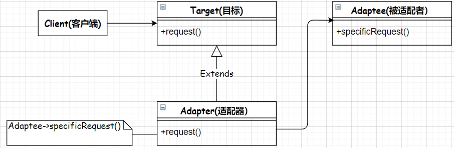
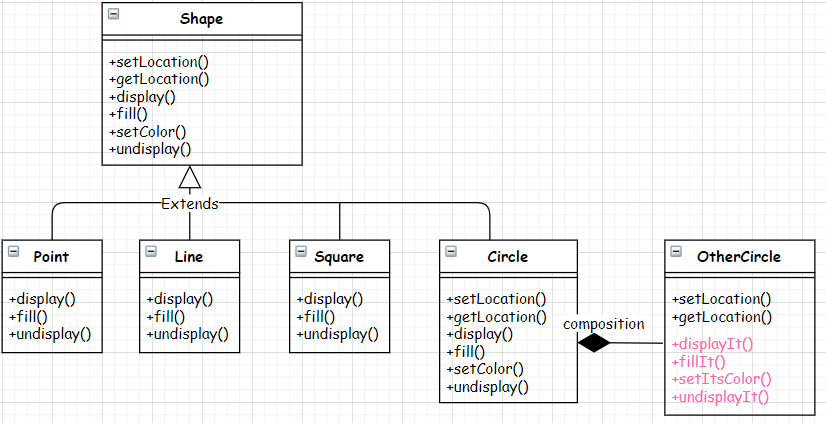

# Adapter
- 作用：转换接口。
- 使用场景：有一个必须遵循的规范接口，同时有一个类已实现所需功能但API不一致，需要适配。

## UML class diagram

## Java code implementation
- Circle类继承自Shape基类
- Circle包含OtherCircle。
- Circle转发自己的请求到OtherCircle对象。

将Shape看做Target，Circle看做Adapter，将OtherCircle看做Adaptee。

可以说，Circle是Shape和OtherCircle之间的桥梁，让Client可以像调用Shape类方法那样调用OtherCircle的方法。

