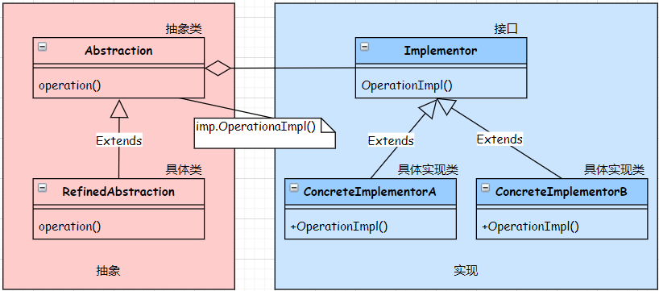
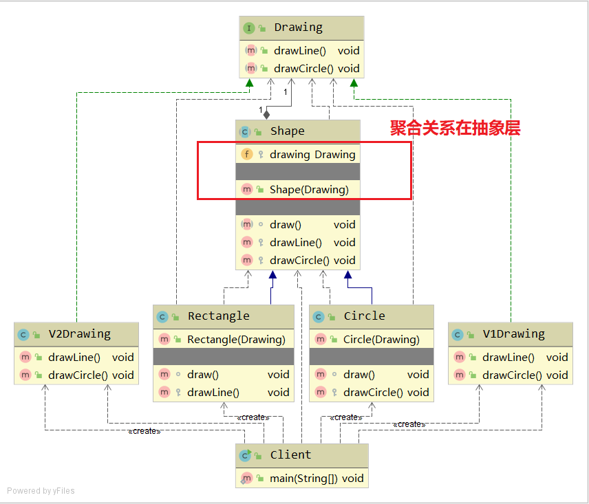

# Bridge
桥接模式。

- 意图：将一组实现与另一组使用它们的对象分离。
- 解决方案：为所有实现定义一个接口，供抽象类的所有派生类使用。
- 参与者与协作者
  - Abstraction为要实现的对象的抽象类
  - Implementor为具体的实现类定义接口
  - ConcreteImplementorA和ConcreteImplementorA都是Implementor的具体实现
  - Abstraction的派生类RefinedAbstraction使用Implementor的实现类，无需知道是哪一个ConcreteImplementor
- 实现
  - 将实现封装于一个抽象类中(指Implementor)
  - 在要实现的抽象基类(指Abstraction)中，包含一个实现的句柄（能够引用具体的实现），可以通过构造函数或者Setter传入

## UML class diagram

- 左侧是抽象，右侧是实现，从而达到了抽象和实现的分离。
- 聚合关联关系建立在抽象层，也就是在Abstraction这个抽象类中。

## Java code implementation

