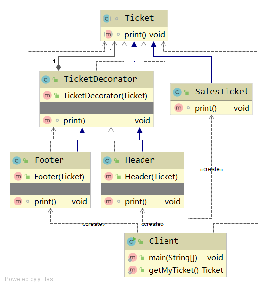

# Decorator
> 动态地给一个对象添加额外的职责。就增加功能而言，比生成子类更加灵活。 --《设计模式》

装饰器模式。
- 作用：动态地给对象增加功能，但不需要修改原对象类。

## 例子分析
假设有一个Ticket类，它具有打印信息的功能。现在需要为这个打印信息添加头部和尾部信息。但是不能修改Ticket类和它的派生类。

实现步骤：
- 创建一个修饰类TicketDecorator，构造函数中将Ticket类型传入，同时在print()中调用该Ticket类型的print()函数。
- 从TicketDecorator派生Header类，在自身构造函数中调用父类构造，并重写print()
- 从TicketDecorator派生Footer类，在自身构造函数中调用父类构造，并重写print()
- 这样就可以使用 new Footer(new Header(new SalesTicket())) 形式的调用来修饰原本的SalesTicket的打印功能。

## Java code implementation


Client用例
```java
public class Client {
    public static void main(String[] args) {
        Ticket myTicket = getMyTicket();
        myTicket.print();
    }

    public static Ticket getMyTicket() {
        return new Footer(new Header(new SalesTicket()));
    }

    /*
    Add header...
    SalesTicket print code logic
    Add footer...
     */
}
```