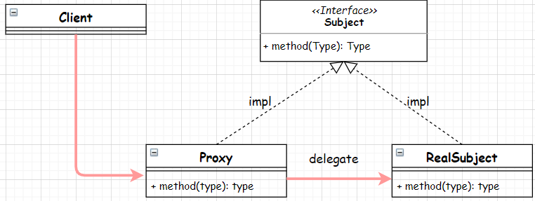

# Proxy


代理模式的角色：
- 行为接口： 即代理类的所实现的行为接口，Subject。
- 目标对象： 被代理的对象，RealSubject。
- 代理对象： 代理类，Proxy。
- 客户端：Client。

## 静态代理
静态代理是指在编译阶段就已经生成代理类。

### 代码实现
```java
public interface Subject {
    void sayHello();
}
```
```java
public class RealSubject implements Subject {
    @Override
    public void sayHello() {
        System.out.println("RealSubject sayHello()");
    }
}
```
```java
public class StaticProxy implements Subject {
    private RealSubject realSubject;

    @Override
    public void sayHello() {
        if (realSubject == null) {
            realSubject = new RealSubject();
        }

        realSubject.sayHello();
    }
}
```
```java
public class Client {
    public static void main(String[] args) {
        StaticProxy staticProxy = new StaticProxy();
        staticProxy.sayHello();
    }
}
```
### 应用
- 延迟加载：系统启动时初始化代理类，而不是实际的类。这样就实现了类的懒加载，将耗费资源多的实际类使用代理进行分离。
- 将目标对象的方法进行改造。例如上面例子中的StaticProxy.sayHello()方法，里面的实现完全自由。
  - 将 Connection 接口中的 close 方法，改为回收到数据库连接池。

## 动态代理
动态代理是指在运行时动态生成代理类。代理类的字节码将在运行时生成并载入当前代理的 ClassLoader。

相比静态代理，动态代理的优势：
- 如果行为接口中的方法很多很多，为每一个接口写一个代理方法也是非常麻烦的事情。
- 动态代理的生成方法可以在运行时制定代理类的执行逻辑，非常灵活。

### JDK动态代理
```java
public class JDKDynamicProxy implements InvocationHandler {
    private RealSubject realSubject;

    @Override
    public Object invoke(Object proxy, Method method, Object[] args) throws Throwable {
        if (realSubject == null) {
            realSubject = new RealSubject();
        }
        method.invoke(realSubject, args);
        return realSubject;
    }
}
```
```java
public class Client {
    public static void main(String[] args) {
        Subject subject = (Subject) Proxy.newProxyInstance(RealSubject.class.getClassLoader()
                , new Class<?>[]{Subject.class}
                , new JDKDynamicProxy());
        subject.sayHello();
    }
}
```
newProxyInstance方法有三个参数
- 类加载器
- 被代理类的接口列表
- 实现InvokeHandler接口的实例

注意：
- Proxy全是静态方法，如果代理类没有实现任何接口，那么代理类就是Proxy类型，没有实例方法。
  - 所以：JDK动态代理才要求，被代理的类必须实现某接口，单纯的类则不可代理。因为单纯的类，也就谈不上实现接口。
- JDK动态代理所生成的代理类会继承 Proxy 类，同时会实现所有你传入的接口列表。因此可以强制类型转换成接口类型。

> 如果一定要使用JDK动态代理去代理一个没有实现任何接口的类？可以使用反射。代码示例TODO。

#### JDK动态代理源码原理
- java.lang.reflect.Proxy.newProxyInstance
  - Class<?> cl = getProxyClass0(loader, intfs);
    - proxyClassCache.get(loader, interfaces);
- java.lang.reflect.Proxy.ProxyClassFactory.apply
  - interfaceClass = Class.forName(intf.getName(), false, loader);
  - byte[] proxyClassFile = ProxyGenerator.generateProxyClass(proxyName, interfaces, accessFlags);

#### 模拟JDK生成一个代理类
```java
public class GenerateProxyClassTest {
    public static void main(String[] args) throws IOException {
        byte[] classFile = ProxyGenerator.generateProxyClass("TestProxyGen",
                RealSubject.class.getInterfaces());
        try (FileOutputStream fos
                     = new FileOutputStream(new File("./TestProxyGen.class"))) {
            fos.write(classFile);
            fos.flush();
        }
    }
}
```
下面将重点解析生成的TestProxyGen.class
```java
public final class TestProxyGen extends Proxy implements Subject {
    private static Method m1;
    private static Method m3;
    private static Method m2;
    private static Method m0;

    public TestProxyGen(InvocationHandler var1) throws  {
        super(var1);
    }

    public final boolean equals(Object var1) throws  {
        try {
            return (Boolean)super.h.invoke(this, m1, new Object[]{var1});
        } catch (RuntimeException | Error var3) {
            throw var3;
        } catch (Throwable var4) {
            throw new UndeclaredThrowableException(var4);
        }
    }

    public final void sayHello() throws  {
        try {
            super.h.invoke(this, m3, (Object[])null);
        } catch (RuntimeException | Error var2) {
            throw var2;
        } catch (Throwable var3) {
            throw new UndeclaredThrowableException(var3);
        }
    }

    public final String toString() throws  {
        try {
            return (String)super.h.invoke(this, m2, (Object[])null);
        } catch (RuntimeException | Error var2) {
            throw var2;
        } catch (Throwable var3) {
            throw new UndeclaredThrowableException(var3);
        }
    }

    public final int hashCode() throws  {
        try {
            return (Integer)super.h.invoke(this, m0, (Object[])null);
        } catch (RuntimeException | Error var2) {
            throw var2;
        } catch (Throwable var3) {
            throw new UndeclaredThrowableException(var3);
        }
    }

    static {
        try {
            m1 = Class.forName("java.lang.Object").getMethod("equals", Class.forName("java.lang.Object"));
            m3 = Class.forName("io.github.wdpm.pattern.structural.proxy.Subject").getMethod("sayHello");
            m2 = Class.forName("java.lang.Object").getMethod("toString");
            m0 = Class.forName("java.lang.Object").getMethod("hashCode");
        } catch (NoSuchMethodException var2) {
            throw new NoSuchMethodError(var2.getMessage());
        } catch (ClassNotFoundException var3) {
            throw new NoClassDefFoundError(var3.getMessage());
        }
    }
}
```
- 构造函数中入参为InvocationHandler var1，显式调用父类构造，初始化h
  ```java
    protected Proxy(InvocationHandler h) {
        Objects.requireNonNull(h);
        this.h = h;
    }
   ```
- 静态代码块static{}中，利用反射机制，对Object三个方法以及代理的方法sayHello进行初始化。
  - 这几个方法的内部实现，全都是委托到父类的invoke方法：`super.h.invoke(this, m?, (Object[])null)`

### CGLib动态代理
> TODO